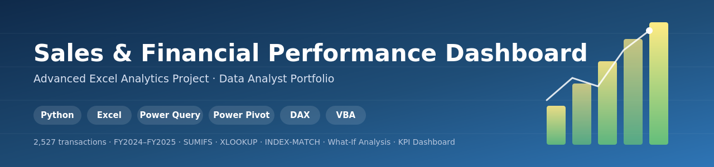

<p align="center">
  
</p>

<h1 align="center">Sales & Financial Performance Dashboard</h1>
<p align="center">
  Advanced Excel analytics project simulating end-to-end retail sales analysis — from raw transactions to an interactive KPI dashboard.
</p>

<p align="center">
  
  
  
  
</p>

---

## Overview

This project simulates 2 years (FY2024–FY2025) of retail sales across 4 regions, 4 product categories, and 10 salespeople, then builds a fully formula-driven Excel workbook on top of it — the kind of deliverable a Data Analyst produces when asked to "make sense of the sales data" for stakeholders.

**Note on tooling:** Python was used only to generate the synthetic raw dataset (2,527 transactions). Every calculation in the workbook — revenue, cost, profit, pivot summaries, scenario outputs, KPIs — is a **live Excel formula**, not a precomputed value. Change any input and the entire workbook recalculates.

## Key Features

| Sheet | What it demonstrates |
|---|---|
| **Dashboard** | KPI cards, an interactive Region filter (data validation dropdown), and 4 linked charts (trend, category mix, top performers, region comparison) |
| **Raw_Sales_Data** | 2,527-row transactional dataset with formula-driven Revenue / Cost / Profit / Margin columns |
| **Formulas_Reference** | `SUMIFS`, `XLOOKUP` (with `INDEX/MATCH` fallback for older Excel), `INDEX-MATCH`, nested `IF` commission-tier logic |
| **Pivot_Analysis** | Region × Month revenue matrix, category performance summary, and ranked salesperson leaderboard — all `SUMIFS`-driven so they update automatically |
| **What_If_Analysis** | Scenario Manager-style Best / Likely / Worst case inputs, plus a discount % sensitivity table (Goal Seek-ready) |

## Tech / Skills Used

- **Excel formulas:** SUMIFS, XLOOKUP, INDEX-MATCH, nested IF, RANK, IFERROR
- **Data validation:** dropdown-driven scenario and region filters
- **Conditional formatting:** color scales, icon sets, KPI-style highlighting
- **Charts:** line, bar, pie — all linked to formula-driven tables
- **What-if analysis:** scenario inputs, sensitivity table (Goal Seek-compatible)
- **Python:** synthetic dataset generation (`pandas`/`csv`, `random`)

## Extending This Project Natively in Excel

The README tab inside the workbook includes exact steps to add:
- **Power Query** — import/clean `Raw_Sales_Data` via Get Data
- **Power Pivot / Data Model** — sample DAX measures (Total Revenue, YoY Growth %)
- **Slicers** — for Region, Category, Year
- **VBA macro** — one-click refresh + PDF export of the Dashboard

## File Structure

```
├── Sales_Performance_Dashboard.xlsx   # Main workbook (6 sheets)
├── banner.svg                         # Project banner
└── README.md                          # This file
```

## How to Use

1. Download `Sales_Performance_Dashboard.xlsx`
2. Open in Excel (2019+ recommended for XLOOKUP support; workbook falls back gracefully on older versions)
3. Start on the **Dashboard** tab — use the Region dropdown to filter
4. Explore **What_If_Analysis** to test Best/Likely/Worst scenarios
5. Optional: follow the **README** tab inside the workbook to add Power Query, Power Pivot, DAX, and a VBA macro

## License

This project is licensed under the **MIT License** — see the [LICENSE](LICENSE) file for details.
